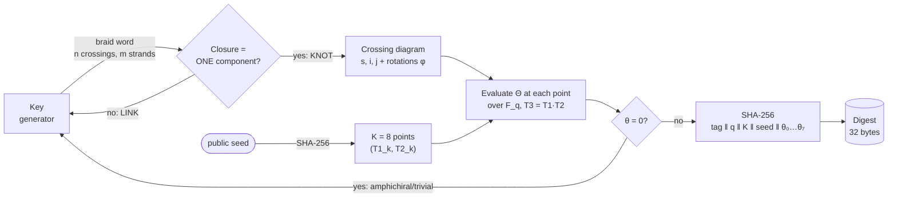

<div align="center">

# HOLO-CRYPTO

### A proof-of-concept **one-way function** from knot topology: the Bar-Natan–van der Veen Θ invariant evaluated over a finite field

**Multi-point evaluation (K = 8) · ~58,000 evaluations/s in C++ (16 threads) · 100% Open Source**


-purple)


</div>

---

> ⚠️ **Read this first.** HOLO-CRYPTO is a **research experiment**, not a production primitive. **It is not a replacement for SHA-256** and does not try to be one. It is a *proof of concept* that a one-way function built from knot invariants can be evaluated in microseconds. To my knowledge there is no public cryptanalysis of it yet, and the reference parameters (`q = 2³¹ − 1`, 4 strands, 5–7 crossings) are deliberately toy-sized. Everything stated as *measured* can be reproduced on your machine; everything that is a *hypothesis* is labeled as one. Section [7 · Call to Break](#7--call-to-break) is an invitation to point out where I am wrong.

## Table of contents

1. [Summary](#1--summary)
2. [Goal and positioning](#2--goal-and-positioning)
3. [Mathematical architecture](#3--mathematical-architecture)
4. [Benchmark results](#4--benchmark-results)
5. [How to reproduce](#5--how-to-reproduce)
6. [Known limitations](#6--known-limitations)
7. [Call to Break](#7--call-to-break)
8. [Related work](#8--related-work)
9. [References and license](#9--references-and-license)

---

## 1 · Summary

Standardized post-quantum cryptography rests almost entirely on **lattices** and on hash functions. HOLO-CRYPTO explores a third road: **knot topology**.

The idea in one sentence:

> From a secret *braid word* build a **knot** (never a link), evaluate its Bar-Natan–van der Veen invariant **Θ = (Δ, θ)** at **K = 8 distinct points** of a **finite field F_q**, and compress the 8 scalars with SHA-256.

What this repository is:

- A **proof of concept (PoC) of a one-way function (OWF)**: easy to compute (microseconds), with *no known* shortcut to invert. The OWF is the object of study; the digest is only its output encoding.
- **Recent mathematics**: Θ dates from 2025 ([arXiv:2509.18456](https://arxiv.org/abs/2509.18456)) and is computable in polynomial time (≈ O(n³)). Knot-based cryptography itself has precedents (§8); what is new here is the *specific* use of Θ.
- **Fast**: a 5–7 crossing knot costs **≈ 136 µs on one thread** and **≈ 17 µs amortized on 16 threads** for the full 8-point evaluation (about 7× the single-point cost, §4). Dependency-free C++17.
- **Unproven**: while knot cryptography has precedents (Ko et al. 2000, Sconza & Wildi 2024; see §8), the specific evaluation of the polynomial invariant Θ over a finite field F_q has, to my knowledge, no public cryptanalysis. That is what this repository is for.

What it is **not**: a drop-in hash function, a signature scheme, or a KEM. Section 2 explains the path from here to those, and which steps are missing.

---

## 2 · Goal and positioning

### 2.1 · Not a SHA-256 competitor

SHA-256 is fast, standardized, and believed to resist known quantum attacks (Grover only halves its exponent). A topological hash that is slower and unanalyzed has no reason to replace it, and I am not proposing that. SHA-256 appears *inside* HOLO-CRYPTO as the final compression layer, not as a rival.

### 2.2 · What the PoC is meant to show

| Question | Answer in this repository |
|---|---|
| Can Θ be evaluated over F_q fast enough to be a cryptographic building block? | **Yes, measured**: 17–136 µs for the 8-point evaluation at toy size (§4). |
| Is the map *braid word → (θ₀,…,θ₇)* one-way? | **Unknown.** No known shortcut, but no public cryptanalysis either. This is the open question. |
| Is the output collision-resistant? | **Not shown.** See §3.4 and §6: the 248-bit figure is an *upper bound* on the output space, not a proof. |

### 2.3 · Long-term goal and what is missing

The long-term goal is to use this OWF as the basis for a **post-quantum digital signature** or an **asymmetric KEM**. Honest roadmap:

| Target | Route | Status |
|---|---|---|
| **Digital signature** | Hash-based constructions (Lamport / Winternitz one-time signatures + Merkle trees) need *only* a one-way function, so a Θ-based OWF could in principle be plugged in. | Plausible, **not built**. It would not be smaller or faster than SPHINCS+/ML-DSA; the benefit would be *diversifying the hardness assumption*. |
| **KEM / public-key encryption** | A bare OWF is **not enough**: public-key encryption cannot be built from a one-way function in a black-box way (Impagliazzo–Rudich). A **trapdoor** structure is needed, e.g. a family of knots where the owner knows a simplifying decomposition that the public diagram hides. | **Open research question.** No construction is proposed here. |

---

## 3 · Mathematical architecture

### 3.1 · Overview



### 3.2 · Structural rule of the generator: **knots only, never links**

A braid on `m` strands with `n` letters `±k` (each letter is a crossing between strands `k` and `k+1`) has a *closure* that is either a **knot** (1 component) or a **link** (several). The generator **only emits braids whose closure is a knot**. The diagram used for evaluation is a single-component (long-knot) diagram, so a link is not a valid input.

The condition comes from the permutation induced by the braid:

1. Each letter is a **transposition**, so the final permutation has sign `(−1)ⁿ`.
2. For the closure to have a single component, the permutation must be **one cycle of length `m`**, whose sign is `(−1)^(m−1)`.
3. Therefore, necessarily:

$$
n \equiv m-1 \pmod 2 \qquad\text{and}\qquad n \ge m-1
$$

and the generator additionally checks explicitly that the permutation is an `m`-cycle.

**Practical consequence:** with `m = 4` strands, **every braid of even length is a link** and is rejected without evaluating anything. The benchmark confirms it empirically:

| Length `n` (m = 4) | Words | Links rejected | **Knots** |
|:-:|--:|--:|--:|
| 5 | 7,776 | 5,216 | **2,560** |
| 6 | 46,656 | 46,656 | **0** *(wrong parity)* |
| 7 | 279,936 | 170,624 | **109,312** |
| 8 | 1,679,616 | 1,679,616 | **0** *(wrong parity)* |

### 3.3 · Evaluation over the finite field F_q

Instead of computing the full polynomial form of Θ (expensive and variable-sized), the invariant is **evaluated at points** of `F_q`, with `q = 2³¹ − 1` (a Mersenne prime) and three related variables `T₁, T₂, T₃ = T₁·T₂`.

For each `Tν` a matrix `A(Tν)` of size `(2n+1)×(2n+1)` is built:

$$
A(T) \;=\; I \;-\; \sum_{c=(s,i,j)} \Big( T^{s}\,E_{i,i+1} + (1-T^{s})\,E_{i,j+1} + E_{j,j+1} \Big)
$$

`G = A⁻¹` is computed by Gauss-Jordan elimination mod q, and everything is combined as:

$$
\theta \;=\; \Delta(T_1)\,\Delta(T_2)\,\Delta(T_3)\cdot\Big(\sum F_1 + \sum F_2 + \sum F_3\Big) \pmod q
$$

where `Δ(T) = T^e · det A(T)` and the exponent is `e = (−Σφ − w)/2`, with `φ` the rotation numbers of the edges and `w` the writhe.

**Why it is fast in C++:**

- Division-free Mersenne reduction: two shift/mask folds plus one conditional subtraction.
- Everything lives in **fixed-size stack arrays** (up to 12 crossings): zero dynamic allocation on the hot path.
- Gauss-Jordan that **skips zero multipliers** (the matrices are very sparse).
- The `6ⁿ` word space is partitioned across threads (`std::thread`).

### 3.4 · Multi-point evaluation (v2): 8 points, one digest

**The problem with a single point.** `θ` lives in `F_q`, so one evaluation carries at most 31 bits. With a single point the digest can take at most ≈ 2³¹ distinct values and **birthday collisions appear after ~2¹⁶ knots**. an earlier internal version had exactly this flaw.

**The fix.** Evaluate `θ` at `K = 8` points derived from a public seed, and hash all 8 values:

```text
point_k   = SHA-256( "holocrypto-v2/point" ‖ seed ‖ k )                  k = 0..7
            T1_k = 2 + (bytes  0..7  mod q−3)      T2_k = 2 + (bytes 8..15 mod q−3)

digest    = SHA-256( "holocrypto-v2/theta8" ‖ q ‖ K ‖ seed ‖ θ₀ ‖ θ₁ ‖ … ‖ θ₇ )
```

Every integer is **8 bytes big-endian**; the digest input is 20 + 24 + 64 = 108 bytes (two SHA-256 blocks). Default seed: `0x484F4C4F43525950` (`"HOLOCRYP"`). A knot whose matrix is singular at *any* of the 8 points is rejected.

**What this buys, and what it does not.**

- **For:** the output space of the 8-vector is up to `8 × 31 = 248` bits, so the *generic* birthday bound becomes ≈ 2¹²⁴ instead of ≈ 2¹⁶.
- **Caveat:** that is an **upper bound that holds only if the 8-vector behaves like a uniform value**, which is **not proven**. The 8 values are evaluations of *one* algebraic object (the same two-variable invariant of the same knot), so they are not independent random numbers. Whether 8 evaluations really behave like 248 independent bits is one of the attack lines in §7.
- **Caveat:** two different knots with the same Θ would collide **no matter how many points are used** (the one mutant pair tested, Conway / Kinoshita–Terasaka, does *not* collide; see §7). More points fix the *field-size* collisions, not the *invariant-incompleteness* collisions.
- **Cost:** ~7× slower (§4.3).

We hash `θ`, never `θ²`: the invariant satisfies `θ(K*) = −θ(K)` for the mirror image `K*`, and squaring would make every knot collide with its mirror. With raw `θ`, mirror images give unrelated digests (`θ₀` shown; all 8 values flip sign):

```text
$ holocrypto_bench.exe --verify "1 2 3 -1 2 1 3"
theta[0]=1883451254  (T1=1496904601 T2=1786645906)
  ... theta[1..7] ...
hash=b3afccc9aee25cfa5249a0089ac1341c9f843e4d2bdb945abc7c911c0549df31

$ holocrypto_bench.exe --verify "-1 -2 -3 1 -2 -1 -3"      # mirror image
theta[0]=264032393                                          # = q − 1883451254
  ... theta[1..7] ...
hash=af3223d5dd5b165d371714a0ba7a52ca78cf0cc28e0eec2e9941dcb2704cbfa6
```

The independent Python reference (`holocrypto_multipoint_ref.py`) reproduces both digests bit for bit.

### 3.5 · Anti-degenerate filter: `θ ≠ 0`

**Amphichiral** knots (identical to their mirror image, such as the unknot or the figure-eight knot 4₁) satisfy `θ = −θ`, i.e. `θ = 0`. They are degenerate keys, so the generator **rejects** them and retries. To avoid false rejections caused by an unlucky evaluation point (Schwartz–Zippel lemma), `θ` is checked at several random points. With the multi-point scheme this is automatic: a key is valid if `θ ≠ 0` at the evaluation points.

```text
$ holocrypto_bench.exe --verify "1 -2 3 1 -2 3 -1"
theta[0..7]=0 ...        ← rejected by the generator
```

**Measured, all 8 points:** of the 111,872 knots, **71,944 have `θ = 0` at all 8 points and none has it at only some of them.** A "partial" zero would be bad luck at a point; an "all-or-nothing" pattern means these are *structural* zeros (`θ ≡ 0` as a function), as expected for trivial/amphichiral knots.

### 3.6 · About the 64% of rejections: a toy-parameter artifact

In the benchmark, 71,944 of 111,872 knots (**64%**) give `θ = 0`. That is a property of the **toy parameters** (4 strands, 5 or 7 crossings), not of the construction:

- With so few crossings there are very few distinct knots. The likely mechanism (a hypothesis; I did not break the 64% down by cause) is that most random words **reduce** (a letter next to its inverse, Markov-type simplifications) to the unknot or to a tiny knot, and the small knots that do exist include amphichiral ones (e.g. 4₁). All of these have `θ = 0`.
- As crossings grow, a random word closes up to an ever more complex, generically chiral knot, and `θ ≠ 0` becomes the typical case.

I tested this instead of just asserting it. For each `(m strands, n crossings)`, I drew uniformly random braid words whose closure is a knot and measured the fraction with `θ = 0` at two random points of `F_q` (`theta_zero_density.py`, seed fixed, 300 samples per cell, 150 for the last):

| `n` crossings | m = 4 | m = 6 | m = 10 |
|:-:|--:|--:|--:|
| 5 | 83.0 % | 100 % | n/a |
| 7 | 65.3 % | 72.3 % | n/a |
| 9 | 49.0 % | 63.7 % | 100 % |
| 11 | 44.3 % | 55.3 % | 75.3 % |
| 15 | 32.0 % | 40.3 % | 55.3 % |
| 21 | 20.0 % | 18.0 % | 32.7 % |
| 31 | 10.0 % | 8.3 % | 12.7 % |
| 51 | 0.7 % | 0.7 % | 3.3 % |
| 101 | n/a | n/a | **0 / 150** |

(The 100% cells are the shortest legal words, `n = m−1`, whose closure is always the unknot.)

**Reading:** in the measured range the rate falls roughly **geometrically**, about **halving every ~10 crossings**, for all three strand counts, and at **10 strands / 101 crossings no sample out of 150 was rejected** (the 95% upper bound from 0/150 is ≈ 2%). That supports the claim that at production-like sizes the filter practically never fires.

**What this is not:** it is an empirical trend on 150–300 samples per cell, not a proof of an asymptotic law, and "decays toward ~0" should be read as *"measured to be negligible at the sizes tested"*. It also does not say the surviving knots are *secure*, only that they are nontrivial and chiral.

---

## 4 · Benchmark results

**Hardware:** AMD Ryzen 7 5800X3D (8 cores / 16 threads), Windows 11. **Compiler:** `zig c++ -O3 -march=native -std=c++17`. **Parameters:** `q = 2³¹−1`, `K = 8`, default seed, 4 strands, alphabet `{1,2,3,−1,−2,−3}`.

Each *iteration* = closure → evaluate θ at **all K points** → SHA-256, over **every** sequence of length 5, 6, 7 and 8 that closes to a knot (111,872 knots; this includes the 71,944 with `θ = 0`, which a key generator would also have to evaluate before discarding them). Throughput of *usable* keys is therefore ≈ 36% of the figures below.

### 4.1 · Multi-threaded (16 threads), K = 8

| Metric | Run 1 | Run 2 | Run 3 |
|---|--:|--:|--:|
| Knots evaluated | 111,872 | 111,872 | 111,872 |
| Total time | 1.896 s | 1.922 s | 1.928 s |
| **Iterations / s** | **58,995** | **58,215** | **58,014** |
| µs per iteration (amortized) | **16.95** | **17.18** | **17.24** |

### 4.2 · Single thread (`-t 1`), K = 8

| Length | Knots | Iterations / s |
|:-:|--:|--:|
| 5 | 2,560 | 13,740 |
| 7 | 109,312 | 7,294 |
| **Total (5–7)** | **111,872** | **7,347** (≈ **136 µs** per knot) |

### 4.3 · Cost of multi-point evaluation (K = 8 vs K = 1)

| Configuration | K = 1 (v1 behaviour) | K = 8 (v2) | Slowdown |
|---|--:|--:|--:|
| 16 threads, µs / iter (amortized) | 2.50 | 17.2 | **≈ 6.9×** |
| 16 threads, iterations / s | 399,384 | ≈ 58,000 | |
| 1 thread, µs / iter | 17.8 | 136.1 | **≈ 7.6×** |
| 1 thread, iterations / s | 56,092 | 7,347 | |

The slowdown is just under 8× because closure construction and SHA-256 are paid once, while only the θ evaluation is repeated K times.

### 4.4 · How to read these numbers (no tricks)

- **"≈ 17 µs" is *amortized* time across 16 threads.** The **latency of a single 8-point evaluation** on one thread is ≈ 136 µs. Both are legitimate; they are not the same thing. Both are still in the "microseconds to a fraction of a millisecond" range, which is what the PoC needed to show.
- These are **small** knots (5–7 crossings). Cost grows roughly as O(n³) per point, so production sizes (§3.6) will be far slower than these figures. They have **not** been benchmarked here.
- The final *checksum* (`c9647977678b33c0`) is identical across all runs and between 1 and 16 threads: it verifies that the result does not depend on parallelism.
- The reference Python engine, plus an independent re-implementation of the multi-point digest, produce **exactly the same digests** as the C++ code (§3.4).
- At this toy scale, single-point collisions are not even observable: among the 39,928 usable keys the expected number of colliding pairs at 31 bits is ≈ n²/2q ≈ 0.4. The multi-point change is about *scaling*, not about fixing something visible in this benchmark.

---

## 5 · How to reproduce

```bash
# Zig (recommended on Windows)
zig c++ -O3 -march=native -std=c++17 holocrypto_bench.cpp -o holocrypto_bench.exe

# or MSVC
cl /O2 /GL /std:c++17 /EHsc holocrypto_bench.cpp /Fe:holocrypto_bench.exe
```

```bash
holocrypto_bench.exe --selftest                 # SHA-256 test vectors
holocrypto_bench.exe                            # full benchmark, K = 8 (lengths 5–8)
holocrypto_bench.exe -t 1 --lens 5,6,7          # single thread
holocrypto_bench.exe -k 1                       # single point, for the 8x comparison
holocrypto_bench.exe --seed 0xC0FFEE            # different public seed -> different 8 points
holocrypto_bench.exe --verify "1 2 3 -1 2 1 3"  # the 8 thetas + digest of one braid
```

Python references:

```bash
python holocrypto_multipoint_ref.py "1 2 3 -1 2 1 3"
# hash=b3afccc9aee25cfa5249a0089ac1341c9f843e4d2bdb945abc7c911c0549df31

python theta_zero_density.py 300               # the θ = 0 density experiment of §3.6
```

The Conway / Kinoshita–Terasaka self-attack of §7 needs a build that accepts 13+ crossings (the default build caps at 12):

```bash
sed 's/constexpr int kMaxN = 12; /constexpr int kMaxN = 16; /' holocrypto_bench.cpp > holocrypto_bench_n16.cpp
zig c++ -O3 -march=native -std=c++17 holocrypto_bench_n16.cpp -o holocrypto_bench_n16.exe
python mutant_test.py                           # mutant pair + representation-invariance checks
```

The single-point version (v1) is preserved in `holocrypto_bench_v1_single_point.cpp` for comparison.

---

## 6 · Known limitations

So that nobody has to "discover" them as if they were a finding:

| # | Limitation | Detail |
|:-:|---|---|
| 1 | **SHA-256 is doing the heavy lifting** | In its current PoC (hash) form, **SHA-256 hides the topology**: anyone who sees only the digest must invert SHA-256, and the hardness of Θ plays no role. The real challenge for the community is to **break the evaluation of Θ assuming the raw `F_q` values `(θ₀,…,θ₇)` and the points were public**, as would happen in a digital signature. Under that assumption there is no SHA-256 shield, and every security statement in this document is unproven. |
| 2 | **The 248-bit figure is an upper bound** | `8 × 31` bits is the size of the output space of the 8-vector. The 8 values are evaluations of one algebraic object, so they are *not* independent, and uniformity is **unproven**. The real collision resistance could be far lower; that is what §7 asks you to test. |
| 3 | **Invariant collisions are unavoidable in principle** | Different knots with equal Θ collide at any `K`; adding points does not help. Whether such pairs exist is open: the one mutant pair tested (Conway / Kinoshita–Terasaka) is separated by `θ` (§7), but one pair proves nothing about the rest. |
| 4 | **One-wayness is unproven** | Security rests on the *hypothesis* that inverting the evaluation (θ-vector → knot) is hard. **It has not been shown to be NP-hard** or anything similar. We simply do not know of a shortcut. The evaluation points are public, which also gives an attacker 8 equations about one object (§7, line 3). |
| 5 | **From OWF to signature/KEM is not done** | Hash-based signatures from a OWF are a standard route but are *not implemented*. A KEM needs a trapdoor and **no construction is proposed** (§2.3). |
| 6 | **Toy key space: the demo hash is trivially invertible** | 4 strands and 5–7 crossings give ≈ 40,000 usable keys. At the ≈ 58,000 evaluations/s of §4, **enumerating every one of them takes about a second**, so anyone can find a preimage of a demo digest by brute force. The demo parameters show *speed*, not *security*. The 64% rejection rate shrinks with size (§3.6) but production-size cost and security are **not measured**. |
| 7 | **The `θ = 0` trend is empirical** | The decay in §3.6 is measured on 150–300 samples per cell, not proven. |
| 8 | **Θ is neither new nor mine** | The invariant is due to Bar-Natan and van der Veen (2025). This repository's contribution is **the OWF/hash construction**: a knot generator with a parity rule, multi-point evaluation over `F_q`, and masking. |
| 9 | **Algebraic structure** | `θ(K*) = −θ(K)` is an exact linear relation; there may be more (see §7). |
| 10 | **Quantum resistance is a hypothesis** | "Post-quantum" here means *"no quantum attack is known"*. With 31-bit `q` the field is trivially small for any generic attack on `θ` itself; real parameters would need a much larger `q`. |

---

## 7 · Call to Break

I'm **Diego Gonzalez Rodriguez**, the author of HOLO-CRYPTO. If you work on knot invariants, braid groups or cryptanalysis and you spot a flaw in this construction, **I would genuinely like to hear about it.** I am publishing the design, the code and the test vectors *before* anyone has analyzed them, so that problems surface early rather than late.

If it holds up, that is good to know. If it does not, I would much rather find out **before** anyone relies on it.

### Attack lines I care about

1. **Collisions.** Two distinct knots (or braids) with the same digest under the same `(q, K, seed)`. Collisions between *mirror images or equivalent braids* are expected and uninteresting; I want **structural** collisions between knots that should differ.
2. **Mutations.** Are there families of knots (mutants, satellites, braids with symmetries) where `θ` coincides *by construction* at all 8 points and can be generated at will? (A first self-test on Conway / Kinoshita–Terasaka found **no** collision; see the next subsection. One pair is not a family.)
3. **Relations between the 8 points.** The evaluation points are public. Does the vector `(θ₀,…,θ₇)` satisfy algebraic constraints (interpolation, rational-function relations) that make it far less than 248 bits, or let one predict `θ_j` from the other seven?
4. **Alexander forgery.** Alexander polynomials can be forged or tailor-made using satellite knots and other known constructions (e.g. a satellite whose pattern has winding number 0 has the Alexander polynomial of the pattern, whatever the companion). Since `Δ` enters `θ` as the factor `Δ(T₁)Δ(T₂)Δ(T₃)`, a main attack vector is to investigate **whether the perturbation `θ` provides enough separation to prevent forgeries**: given a target `Θ`-vector, can an attacker build a knot with the right `Δ` by construction and then adjust `θ`? This is an attack hypothesis, not a demonstrated result.
5. **Linearity and algebraic relations between knots.** Beyond `θ(K*) = −θ(K)`: do linear or polynomial relations exist between the `θ` of related knots (connected sums, crossing changes, twists) that would let one predict digests without evaluating?
6. **Preimage.** Given the public seed and a digest, recover *one* valid braid word faster than brute force. The harder and more interesting version: given the **raw 8 `θ` values** (no SHA-256), find *any* knot whose `Θ` matches.
7. **Small fields.** With a 31-bit `q`, can information about the knot be recovered by attacking `Δ(T)` (an evaluated Alexander polynomial) and/or the `Fᵢ` terms separately?
8. **Generator weaknesses.** Bias in the distribution of generated knots, or leakage through the parity rule / the `θ ≠ 0` filter. In particular: does the decaying-rejection trend of §3.6 hold, and are surviving knots uniformly spread?
9. **Implementation flaws.** Errors in the Mersenne reduction, overflows, or discrepancies between the Python and C++ versions.

### First self-attack: the Conway / Kinoshita–Terasaka mutant pair

Before publishing I ran attack line 2 against the most famous mutant pair myself. The Conway knot (11n34) and the Kinoshita–Terasaka knot (11n42) differ by a mutation, so they share many invariants, including the Alexander polynomial.

| | Conway 11n34 | Kinoshita–Terasaka 11n42 |
|---|:-:|:-:|
| Braid word | `2 2 2 1 -3 -2 -2 1 -2 1 -3` | `1 1 1 3 3 2 -3 -1 -1 2 -1 -3 -2` |
| Crossings in the word | 11 | 13 |
| Seifert genus | 3 | 2 |
| Alexander polynomial Δ | 1 | 1 |
| Hyperbolic volume | 11.2191177 | 11.2191177 |
| Digest (default seed) | `3e09f21e…bbb6` | `5289aa05…c608` |

The two words come from the CRC Concise Encyclopedia of Mathematics; both knots were identified independently with SnapPy 3.1.1 and knot Floer homology.

- **Result:** `θ` separates them, with **8 of 8** values different at the default seed (also 0 of 8 equal at two other seeds, and 0 of 16 at `K = 16`). The values are not negatives of each other either, so this is not a mere chirality effect, and the mirror control `θ(K*) = −θ(K)` holds at every point.
- **Representation check:** 60 rewritten braid words per knot (conjugations, braid relations, far commutations, `σσ⁻¹` insertions; up to 15 crossings) gave the same digest as the original in all 120 cases. The independent Python reference reproduces both digests bit for bit.
- **Where the difference comes from:** since `Δ = 1` for both knots, the factor `Δ(T₁)Δ(T₂)Δ(T₃)` equals 1 and the whole difference comes from the perturbation terms `Fᵢ`. This is mild evidence that `θ` carries information that `Δ` does not (relevant to attack line 4).
- **What this does not show:** it is a *negative* result for one attack on one pair, found by the author. It is not a proof that Θ separates all mutants, it says nothing about satellite constructions or about forging a target `Θ`-vector, and nobody else has reviewed it.
- **Reproduce:** `python mutant_test.py` (needs a build with `kMaxN ≥ 13`; instructions are at the top of the script). The exact digests are in [`TEST_VECTORS.md`](TEST_VECTORS.md).

Mutants from other families, higher braid index, and prescribed-Δ constructions are still open.

### How to report a finding

- Open an **Issue** with the label `break-attempt` (or a Pull Request containing the counterexample).
- Include a **reproducible input** (braid words, `m`, `q`, `K`, `seed`) and the output of `--verify`.
- An attack that **works only against `q = 2³¹−1`** is still useful and welcome: it helps decide which parameters are needed.
- There is **no monetary bounty**; every valid finding gets **public credit** in this README.

### What counts as "breaking it"

| Result | Verdict |
|---|---|
| Reproducible structural collision | **Collision-resistance break** |
| Preimage faster than brute force | **One-wayness break** |
| Algebraic relation among the 8 `θ` or that predicts digests | **Structural weakness** |
| Attack that requires a small `q` | **Parameter limit** |
| Implementation error | **Bug** |

> *If you break it, I will have learned something valuable. If it holds, we will at least have a first piece of evidence that it is worth pursuing.*

---

## 8 · Related work

HOLO-CRYPTO is **not the first use of knots or braids in cryptography**, and the history is a reason for skepticism, not comfort.

- **Braid-group cryptography.** Ko et al. (CRYPTO 2000) proposed a public-key system based on conjugacy-type problems in braid groups; Anshel–Anshel–Goldfeld (1999) proposed a key-exchange on the same platform. **These schemes have a record of severe vulnerabilities**: length-based attacks (Myasnikov–Ushakov, PKC 2007) break random instances of AAG for certain parameters, and Cheon–Jun (CRYPTO 2003) gave a polynomial-time algorithm for the braid Diffie–Hellman conjugacy problem, the problem behind the Ko et al. scheme (their attack does not cover the AAG protocol). That history justifies a skeptical first reading of any braid/knot proposal, this one included.
- **Mutant prime knots.** Marzuoli & Palumbo (2010, *Int. J. Geom. Methods Mod. Phys.* 2011) proposed a hybrid asymmetric/symmetric scheme in which security rests on the difficulty of decomposing knots built from connected sums of prime knots and their mutants.
- **Sconza & Wildi (ePrint 2024/471, last revised September 2025), the closest published work I know of.** [*A Knot-based Key Exchange protocol*](https://eprint.iacr.org/2024/471) builds a key exchange from a semigroup action (oriented knots under connected sum) and uses **finite-type knot invariants** so that both parties derive a shared secret from the same knot drawn in two different ways; its security rests on the hardness of decomposing knots in that semigroup. I have read only the abstract, not the full paper, so I do not describe its details (attacks, parameters, hashing) here. What I can say: it also builds cryptography on knot *invariants*, but as a key exchange based on decomposition hardness, whereas this repository evaluates the polynomial invariant Θ over `F_q` on braid closures and studies it as a one-way function. Their paper should be read **before** judging whether this one adds anything.

So the claim made here is deliberately narrow: while knot cryptography has precedents, the specific evaluation of Θ over a finite field `F_q` has, to my knowledge, no public cryptanalysis.

---

## 9 · References and license

- D. Bar-Natan, R. van der Veen, Θ = (Δ, θ) invariant, [arXiv:2509.18456](https://arxiv.org/abs/2509.18456).
- Mersenne prime `q = 2³¹ − 1` · SHA-256 (FIPS 180-4).
- Schwartz–Zippel lemma (the `θ ≠ 0` filter at ≥ 2 random points).
- Ko, Lee, Cheon, Han, Kang, Park, *New Public-key Cryptosystem Using Braid Groups*, CRYPTO 2000.
- I. Anshel, M. Anshel, D. Goldfeld, *An algebraic method for public-key cryptography*, Math. Res. Lett. 1999.
- A. Myasnikov, A. Ushakov, *Length based attack and braid groups: cryptanalysis of Anshel-Anshel-Goldfeld key exchange protocol*, PKC 2007.
- J. H. Cheon, B. Jun, *A polynomial time algorithm for the braid Diffie-Hellman conjugacy problem*, CRYPTO 2003.
- A. Marzuoli, G. Palumbo, *Post Quantum Cryptography from Mutant Prime Knots*, [arXiv:1010.2055](https://arxiv.org/abs/1010.2055).
- S. Sconza, A. Wildi, *A Knot-based Key Exchange protocol*, [ePrint 2024/471](https://eprint.iacr.org/2024/471).
- L. Lamport, *Constructing digital signatures from a one-way function* (1979); R. Merkle, *A certified digital signature* (1989). Route from a OWF to signatures.
- R. Impagliazzo, S. Rudich, *Limits on the provable consequences of one-way permutations* (1989). Why a KEM needs more than a OWF.

**Repository files**

| File | Contents |
|---|---|
| `holocrypto_engine_v1.py` | Reference engine (Python / NumPy) |
| `holocrypto_bench.cpp` | C++17 port, **multi-point (v2)**, combinatorial benchmark, SHA-256 |
| `holocrypto_bench_v1_single_point.cpp` | Original single-point version (v1), kept for comparison |
| `holocrypto_multipoint_ref.py` | Independent Python reference of the 8-point digest |
| `theta_zero_density.py` / `.json` | Experiment behind the `θ = 0` table of §3.6, and its raw results |
| `TEST_VECTORS.md` | Reference words with their 8 θ values and digests, generated by the C++ build |
| `mutant_test.py` | Conway / Kinoshita–Terasaka self-attack and representation-invariance check (§7) |
| `LICENSE` | MIT License |
| `README.md` | This document |

**License:** MIT License

**Author:** Diego Gonzalez Rodriguez · [LinkedIn](https://www.linkedin.com/in/diego-gonzalez-rodriguez-421190294)

**Contact:** open an [Issue](../../issues) on this repository (preferred, so findings stay public), or message me on LinkedIn.

<div align="center">

*Defensive publication: this document and the accompanying code are published on October 2026 as prior art.*

</div>
